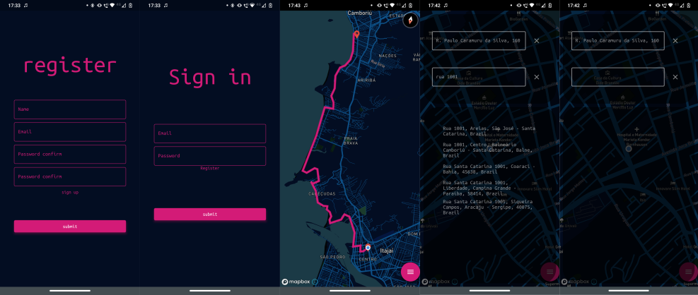

# Pyke

## Uma alternativa para mobilidade urbana 
O conceito central da aplicação é dar mais conforto a ciclistas fazendo a combinação de rotas, inicialmente divididas em 2 categorias: para ciclistas esportivos e para ciclistas casuais.

### Esportivo 
Neste modo ao escolher o ponto de partida e o de chegada a aplicação irá calcular o caminho mais rápido entre eles.

### Casual
Neste modo o ciclista será conduzido a uma rota mais segura sendo preferencial no calculo da rota: ciclovias e ruas pouco movimentadas que serão feitos com dados próprios da aplicação.

## Como Funciona?
<p align="center"> 
  
</p>

## Full Preview 

### O que foi usado? 
- Flutter 
- Provider 
- MapBox-gl
- MapBox API


## Instalação
Com o [flutter](https://flutter.dev/docs/get-started/install) instalado corretamente basta instalar as dependências com:


```bash
flutter pub get
```

e criar um arquivo ".env" com o seguinte conteúdo: 
```dart
MAPBOX_KEY=SUA_CHAVE_DO_MAPBOX;

```

## Como está andando a aplicação?
- [X] Customização do mapa do app
- [X] Obter a Localização do usuário (com a sua permissão) 
- [X] Buscar e listar as localizações conforme o usuário digita sua localização
- [X] Desenhar as rotas escolhidas na aplicação
- [X] Conexão e tratamento dos dados com as apis mapbox
- [X] Migrar do provider para o Bloc pattern com rxdart
- [ ] Carregar do backend as rotas customizadas
- [ ] Login com JWT
- [ ] Permitir o usuário escolher sua rota favorita
- [ ] Obter mais dados do usuário
- [ ] Melhorar o design da rota
- [ ] testes unitários

#### :tada: :tada: Lançamento do app :tada: :tada:
## possiveis features após lançamento
- Adição de propagandas para monetização
- Criação de contas premium (sem propaganda)
- Busca de pessoas para população do banco de dados 

## Contribuição
Qualquer contribuição será bem-vinda basta dar um pull request :)

## Licença
[MIT](https://www.mit.edu/~amini/LICENSE.md)
